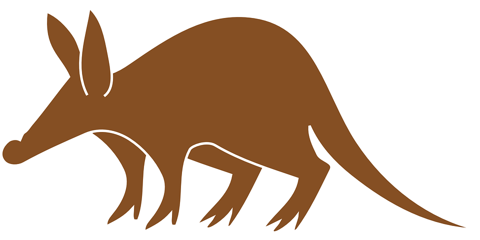

# Team Aardvark--Restaurant Booking And Billing System

  

  

  

A ***grand welcome*** to the home page of Team Aardvark, where **science** is the way to glory.
  

The project entailed development of a simple restaurant table booking and billing system. The implementation used is purely Python based. Also, both the client and server are desktop based.
  

For more details about the project, potentially navigating through the four main sections of the wiki might help (links and **sitemap** to each section at the end of this page).
  

# Contacts
|                       Name                        |         Email        |   Phone No.  |
| ------------------------------------------------- |:--------------------:| ------------:|
| [Danilo Andrade](https://gitlab.com/u/ed11d2a)    | ed11d2a@leeds.ac.uk  |  07472440699 |
| [Jhighar Mistry](https://gitlab.com/u/sc14jm)     | sc14jm@leeds.ac.uk   |  07472440699 |
| [Othman Ali Khan](https://gitlab.com/u/sc14omsa)  | sc14omsa@leeds.ac.uk |  07472440699 |
| [Pam Iwalewa](https://gitlab.com/u/sc13pi)        | sc13pi@leeds.ac.uk   |  07472440699 |
| [Taiwo Kareem](https://gitlab.com/u/sc14tsk)      | sc14tsk@leeds.ac.uk  |  07472440699 |
  

# Sections:
 

1. [Meetings](meetings)
  

2. [Coding Documentation](coding-documentation)
  

3. [Scrum Artifacts](scrum-artifacts)
  

4. [References](references)
  

---

